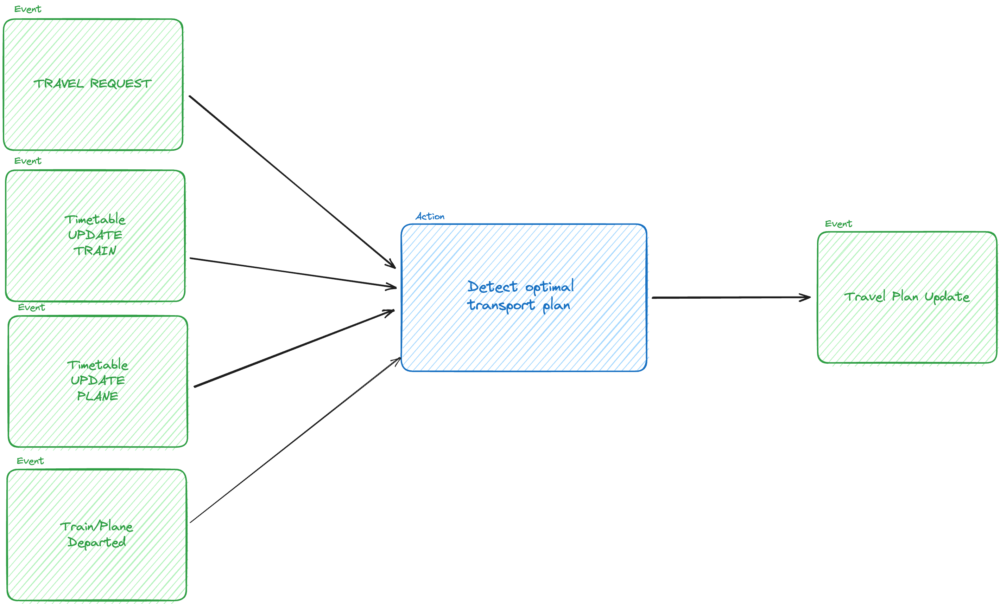
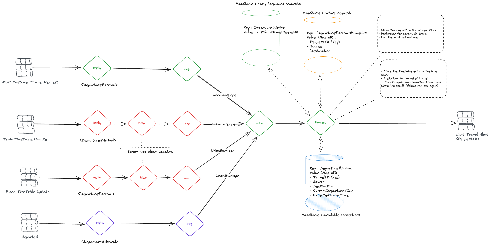
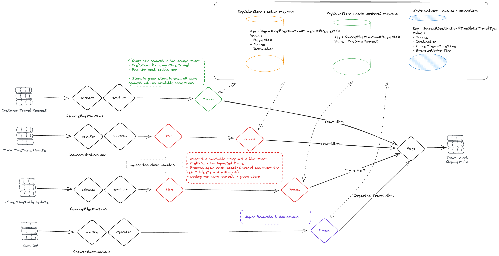

# flink-kafka-stream-implementation

This project aims to demonstrate the key differences between Apache Flink® DataStream API & Apache Kafka® Streams
Processor API.

## License notes

This project is under Apache 2.0 license.

Please note that, due to missing ZonedDateTime serialization in Apache Flink® Kryo embedded library (2.24.0) version, we
reused
some existing serializer implementation from
the official project.
You'll find the detailed license requirements in the project root. It will be removed as soon as the Apache Flink® is
Updated ([FLIP-317](https://cwiki.apache.org/confluence/display/FLINK/FLIP-317%3A+Upgrade+Kryo+from+2.24.0+to+5.5.0))

## The objective

Starting from a dummy transport optimization issue, we aim to compare the approach in design & implementation between
Apache Kafka® Streams & Apache Flink® DataStream.

### The use case

Individuals wants to know when the next most efficient travel is planned for a specific connection (ex : DFW (Dallas) to
ATL (Atlanta))

Four existing events are available to consume (We will use a Apache Flink® Datagen job) :

- CustomerTravelRequest : a new customer emit the wish for a travel on a connection
- PlaneTimeTableUpdate : a new plane as been scheduled or moved around
- TrainTimeTableUpdate : a new train as been scheduled or moved around
- Departure : a train or plane departed

We want to manage all those scenarios :

- The customer asks for an available connection : he receive an immediate alert
- The customer asks for an unavailable connection : he will receive a notification as soon as transport solution is
  available
- An existing customer request is impacted by new transport availability or timetable update : the customer will receive
  the new optimal transportation information
- An existing customer request is impacted by a transport departure



### Apache Flink® Design



### Apache Kafka® Streams Design



### Public / Business Data models

**DISCLAIMER** :
We consciously chose to split Train & Plane timetable updates to challenge N-Ary reconciliation capabilities of both
technologies.
We are aware that all of this could have been simplified by merging those two events in one.

The current implementation of "most efficient" is currently : the available connection that will arrive the sooner.

- [CustomerTravelRequest](models/src/main/java/org/lboutros/traveloptimizer/model/CustomerTravelRequest.java)
- [PlaneTimeTableUpdate](models/src/main/java/org/lboutros/traveloptimizer/model/PlaneTimeTableUpdate.java)
- [TrainTimeTableUpdate](models/src/main/java/org/lboutros/traveloptimizer/model/TrainTimeTableUpdate.java)
- [TravelAlert](models/src/main/java/org/lboutros/traveloptimizer/model/TravelAlert.java)
- [Departure](models/src/main/java/org/lboutros/traveloptimizer/model/Departure.java)

### Internal Data models

#### Apache Flink®

Apache Flink® required specifically :

- some dummy List & Map models to achieve "Range Lookup" in the statestores
- an Envelope (Container) model to merge different object types in one in order to achieve N-Ary processing

- [AlertMap](flink/src/main/java/org/lboutros/traveloptimizer/flink/jobs/internalmodels/AlertMap.java)
- [RequestList](flink/src/main/java/org/lboutros/traveloptimizer/flink/jobs/internalmodels/RequestList.java)
- [TimeTableEntry](flink/src/main/java/org/lboutros/traveloptimizer/flink/jobs/internalmodels/TimeTableEntry.java)
- [TimeTableMap](flink/src/main/java/org/lboutros/traveloptimizer/flink/jobs/internalmodels/TimeTableMap.java)
- [AlertMap](flink/src/main/java/org/lboutros/traveloptimizer/flink/jobs/internalmodels/AlertMap.java)
- [UnionEnvelope](flink/src/main/java/org/lboutros/traveloptimizer/flink/jobs/internalmodels/UnionEnvelope.java)

#### Apache Kafka® Streams

We only added a data model for time table updates:

- [TimeTableEntry](kstreams/src/main/java/org/lboutros/traveloptimizer/kstreams/topologies/models/TimeTableEntry.java)

## How to build

### Prerequisites

- Java 11 (not less not more)
- Maven 3.X

```bash
mvn clean package
```

## How to run

### Prerequisites

- Java 11 (not less not more)
- A Apache Flink® CLuster
- A consumer.properties & producer.properties files in your resource folder (here's
  a [template](flink/src/main/resources/template.properties))

```bash
flink run -c org.lboutros.traveloptimizer.flink.datagen.DataGeneratorJob target/flink-1.0-SNAPSHOT.jar
flink run -c org.lboutros.traveloptimizer.flink.jobs.TravelOptimizerJob target/flink-1.0-SNAPSHOT.jar
```

## Useful Resources

- [Apache Flink® 101](https://developer.confluent.io/courses/apache-flink/intro/)

- [Apache Kafka® Streams 101](https://developer.confluent.io/courses/kafka-streams/get-started/)

- [Practical Event Modeling](https://developer.confluent.io/courses/event-modeling/intro/)

- [Building Apache Flink® Applications in Java](https://developer.confluent.io/courses/flink-java/overview/#building-apache-flink-applications-in-java)

## Backlog

This project is under-construction, the remaining identified steps are :

- Implement the equivalent use-case with Apache Kafka® Streams
- Implement a more complex efficiency logic to validate the business logic scalability of our designs